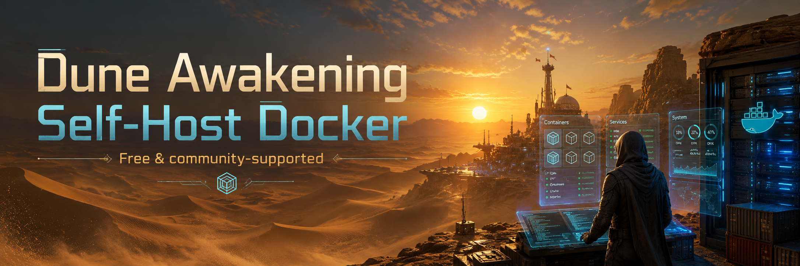

# Dune Awakening Self-Host Docker

<p align="center">
  
</p>


A RedBlink community project for running Dune: Awakening self-host servers with Docker.

This project provides a simple `dune` command and an interactive manager for running a self-host server without remembering every script.

This is an unofficial community project. It is not affiliated with, endorsed by, sponsored by, or supported by Funcom.

## Requirements

| Requirement | Notes |
|---|---|
| Linux Server | Ubuntu 24.04.4 LTS |
| Docker Engine | Required |
| Docker Compose | Required |
| Funcom Self-host token | Required |
| Disk space | 100 GB+ |
| RAM | See Guide Below |
| CPU Features | AVX and AVX2 required |

### RAM Sizing Guide

| Server Layout | Recommended RAM |
|---|---:|
| Basic Hagga Basin / Sietch Layout | 20 GB |
| Hagga Basin plus Story/Social Maps | 30 GB |
| Hagga Basin plus Story/Social Maps + Deep Desert | 40 GB |

## Install

```bash
git clone https://github.com/Red-Blink/dune-awakening-selfhost-docker.git
cd dune-awakening-selfhost-docker
sudo runtime/scripts/install-command.sh
```

Start by deploying the stack and creating the local world:

```bash
dune init
```

`dune init` is the first step. It creates the local config, saves your Funcom token, generates the battlegroup ID, deploys the stack, applies the database/world setup, and starts the services.

If `dune init` says `docker: command not found`, install Docker Engine first.

If Docker is installed but `dune init` says the Docker daemon is not reachable, make sure Docker is running and that your user can access it:

```bash
sudo systemctl enable --now docker
sudo usermod -aG docker $USER
newgrp docker
```

After `dune init` finishes, use the friendly menu:

```bash
dune manager
```

The manager is organized around the main jobs most hosts need:

| Menu | What It Does |
|---|---|
| Battlegroup Overview | Status, readiness, version, containers, and ports |
| Battlegroup Settings | Battlegroup name, Start, Stop, Restart, Scheduled Restart, Redeploy, dynamic maps, autoscaler, database maintenance, and current config |
| Sietches | Map list, current map memory usage, and supported map settings |
| Updates | Installed versions, runtime files status/repair, stack update checks, game server update checks, and automatic game updates |
| Logs | Redacted logs for the main services |
| Advanced Tools | Diagnostics and safe low-level details |

When starting or restarting from the manager, the configured player-facing IP is checked first. If your public or LAN IP changed, the manager asks before updating `.env` and continuing.

Manager menus use a colored `[X]` selector in interactive terminals. Use Up and Down to move, Enter to select, and the explicit Back items to return. Ctrl+C exits normal menu screens cleanly; inside an input prompt it cancels the current action without saving changes. Plain numbered menus are used automatically when the terminal is not interactive.

Running `dune init` again later resets the local database/world after backing up local state.

If map containers fail immediately with `Illegal instruction (core dumped)`, the host CPU exposed to the machine is usually missing `avx` and `avx2`. This is common with misconfigured VMs. It cannot be fixed with a package inside Ubuntu; the hypervisor must expose those CPU features to the guest.

## Public vs Local/LAN

| Mode | Who can connect? | Notes |
|---|---|---|
| Public / Internet | Players over the internet | Requires public-facing network access. See the Ports section below. |
| Local / LAN | Players on the same network | No internet port forwarding expected. |

## Ports

Open or forward these ports when hosting a public / internet server:

| Port | Protocol | Purpose |
|---|---|---|
| `31982` | TCP | RabbitMQ game TLS |
| `31983` | TCP | RabbitMQ game HTTP |
| `7777` | UDP | Overmap client traffic |
| `7778` | UDP | Survival_1 client traffic |
| `7779-7810` | UDP | Dynamic map client traffic |
| `7888` | UDP | Survival_1 server-to-server traffic |
| `7889` | UDP | Overmap server-to-server traffic |
| `7890-7921` | UDP | Dynamic map server-to-server traffic |

These ports are not meant to be opened publicly:

| Port | Protocol | Purpose |
|---|---|---|
| `15432` | TCP | Postgres localhost |
| `32573` | TCP | RabbitMQ admin localhost |
| `5059` | TCP | TextRouter localhost |
| `11717` | TCP | Director localhost |

## Common Commands

| Command | Purpose |
|---|---|
| `dune manager` | Interactive control panel |
| `dune init` | Fresh setup / reset setup |
| `dune start` | Start the battlegroup and autoscaler |
| `dune stop` | Stop the battlegroup and autoscaler |
| `dune ready` | Quick OK / WAIT / FAIL readiness check |
| `dune status` | Safe dashboard summary |
| `dune doctor` | Troubleshooting checks with suggested fixes |
| `dune version` | Launcher, git, build, image, and config summary |
| `dune logs <service>` | Redacted service logs |
| `dune restart <service>` | Restart one service |

`dune ready` is the fast health check. `dune status` is the fuller dashboard.

## Logs

Default logs are redacted for common tokens and IDs:

```bash
dune logs survival
dune logs director
dune logs gateway
dune logs text-router
dune logs rmq-game
```

Raw logs are available with `--raw`, but may contain sensitive data:

```bash
dune logs director --raw
```

## Updates

```bash
dune self-update check
dune self-update install latest
dune update check
dune update
dune update --yes
dune update auto enable
dune update auto disable
dune update auto status
```

`dune self-update` is for this self-host stack itself. `dune update` is for Funcom game server files and images. Automatic updates apply only to game server updates and use a systemd timer when systemd is available.

For stack updates, publish a GitHub Release from the same commit that contains the matching `VERSION` value. The updater validates that the downloaded release tag and extracted `VERSION` file agree.
If local tracked project files were edited, the stack updater warns and still continues after backing up the current project files first.

In the manager, `Updates` also includes `Runtime Files Status` and `Repair Runtime Files`. Use these when generated map catalogs are missing and `Edit Map` cannot open the picker. The repair action rebuilds the generated catalogs from the installed server files without running `dune init`, and if the battlegroup services are not running it starts them automatically afterward.

## Autoscaler And Dynamic Maps

Always-on maps:

| Map | Status |
|---|---|
| Survival_1 | Always running |
| Overmap | Always running |

Autoscaler commands:

```bash
dune autoscaler status
dune autoscaler start
dune autoscaler stop
dune autoscaler restart
dune autoscaler logs
dune servers
```

The autoscaler starts with `dune start` so maps can be deployed automatically when players travel to dynamic regions.

Dynamic maps use the port ranges listed in the Ports section.

`Survival_1` and `Overmap` are always-on protected maps. The manager will not stop them from the dynamic maps menu.

## Database Backups

```bash
dune db backup
dune db list
dune db status
dune db delete dune-db-<scope>__YYYYMMDD-HHMMSS.dump
dune db delete dune-db-<scope>-YYYYMMDD-HHMMSS.backup
dune db delete --all
dune db import runtime/backups/db/<backup-file>.backup
dune db restore runtime/backups/db/<backup-file>.backup
dune db auto enable 12
dune db auto enable 1 7
dune db auto retention 7
dune db auto retention off
dune db auto disable
dune db auto status
```

`dune-docker` writes official-style `.backup` files with a `.backup.yaml` sidecar under `runtime/backups/db/`. These backups do not include Funcom tokens or secret files. The backup artifact keeps a scope-aware name so battlegroup and map context are still identifiable later.

Import and restore accept official Funcom-style `.backup` files plus older `dune-db-*.dump` and `.sql` backups. Import/restore replaces the current battlegroup database state, requires confirmation, and creates a pre-import backup first.

After restore/import, do not let players create new characters until the restored database is verified. In the normal case, players keep the same FLS/Funcom account and no transfer is needed. Character transfer is only for players whose account identity changed.

In the manager, `Import Database Backup` has two paths:

- `Import Local Backup File` prompts for a local file path, copies the selected `.backup`, `.dump`, or `.sql` file into `runtime/backups/db/`, copies `<file>.yaml` when present, then runs the normal restore confirmation flow.
- `Import Remote Backup Over SSH` prompts for the remote host or IP, SSH user, SSH port, and remote backup directory. It requires both `ssh` and `scp`, lists remote `.backup` files, copies the selected backup into `runtime/backups/db/`, copies `<file>.yaml` when present, then runs the same restore confirmation flow locally.

Automatic backups use a systemd timer when systemd is available. Optional retention keeps backups from the last X days, for example `dune db auto enable 1 7` backs up hourly and keeps the last 7 days.

In the manager, database maintenance includes `Create Database Backup`, `Import Database Backup`, `Restore A Database Backup`, `Delete A Backup`, `Delete All Backups`, and `Automatic Database Backups`. Restore and delete flows show available backups first. `Import Database Backup` supports local files and remote SSH imports, and carries the `.yaml` sidecar along when present. Deleting backups is permanent.

### Character Transfer / Account Takeover

Character transfer is exposed under `dune db transfer` and in `dune manager` -> `Database Maintenance` -> `Character Transfer / Account Takeover`. It uses Funcom's database functions:

```bash
dune db transfer OLD_FLS_ID NEW_FLS_ID
dune db transfer --dry-run OLD_FLS_ID NEW_FLS_ID
dune db transfer --file runtime/backups/db/transfer-plan.tsv
dune db transfer pending
dune db transfer apply-pending
dune db transfer clear-pending
```

The new account must log in once before transfer so it exists as a registered empty account in `dune.encrypted_accounts`. The transfer swaps the Funcom/FLS identity; character data stays in place. There is no undo except restoring a database backup, so the command creates a backup by default before applying live transfers. Normal output redacts FLS IDs.

If a player logs in with the same account as before, restore alone should bring the character back. Do not create a new character first. Creating a new character writes new live state into the database and can overwrite the account state you were trying to recover.

Transfer plan files are TSV:

```text
old_fls_id<TAB>new_fls_id<TAB>optional_note
```

Blank lines and lines starting with `#` are ignored. Restore and import can apply transfer plans after the database is imported:

```bash
dune db restore runtime/backups/db/example.backup --transfer OLD=NEW
dune db import runtime/backups/db/example.backup --transfer-file runtime/backups/db/transfer-plan.tsv
```

If the old account exists after restore but the new account has not logged in yet, the pair is saved to `runtime/generated/pending-character-transfers.tsv`. Restart the stack, have the new account log in once, then run `dune db transfer apply-pending`.

## Battlegroup And Sietch Settings

Change or show the battlegroup title:

```bash
dune config title
dune config title "My New Server Name"
```

Changing the title restarts only the Gateway service, which publishes the browser-facing server name.

Configure memory for maps/servers:

```bash
dune memory status
dune memory list-maps
dune memory set survival 12g
dune memory set overmap 8g
dune memory set default 8g
dune memory set DeepDesert_1 10g
dune memory unset DeepDesert_1
```

Use `dune memory list-maps` or the manager to choose from known maps instead of memorizing internal names. Changing or removing a map memory setting asks for confirmation; if that map is running, only that map restarts so the new limit can apply. Default memory applies to future spawned/restarted maps and does not restart running maps.

The manager's Sietches area lists maps from the current world partition state when Postgres is running, with the generated map catalogs as a fallback:

```bash
dune sietches list
dune sietches show Survival_1
```

Inside Sietches, use `List Maps`, `Edit Map`, `Edit A Dimension`, and `Current Memory Usage`. The current memory view shows live memory usage for running map containers and automatically reflects dedicated maps as they spawn and despawn. In the manager, `Survival_1` supports memory, display name, password, and per-dimension `UserGame.ini` overrides. Other maps, including `Overmap`, support memory and per-partition `UserGame.ini` overrides. Passwords are stored locally under `runtime/generated/` and are never displayed.

User settings are generated from `runtime/generated/usersettings.json` into each map server's `Saved/UserSettings` directory before that container starts, matching Funcom's `Saved/UserSettings/UserEngine.ini` and `Saved/UserSettings/UserGame.ini` layout. `UserEngine.ini` is global and is written to every map server. `UserGame.ini` is edited per selected dimension/partition in the manager; partition values use the real numeric `partition_id` from `dune.world_partition` or `runtime/generated/partition-catalog.json`, not `dimension_index`. Display name and password remain managed through the existing Sietch display/password flows, not the UserEngine editor. These settings generally require restarting the affected map/server container to apply. Funcom notes that building limit settings such as landclaim segment count and building restriction limits also need matching client-side config. The generated `UserGame.ini` includes the known Funcom defaults plus advanced community-documented keys for progression, economy, harvesting, survival, inventory, storms, sandworms, clans, vehicles, and patrol ships.

`dune sietches` still provides the backend controls for max dimensions and active dimensions, but those controls are intentionally not exposed in the manager for this version.

For `Survival_1`, display name and password changes are applied by republishing the browser-facing sietch state without respawning the selected dimension. `Overmap` is protected and only supports memory changes. Dedicated scaling maps have active dimensions managed by the autoscaler at runtime.

If a map setting fails validation or cannot be saved, the manager does not ask to restart that map.

## Dynamic Maps

The Docker autoscaler keeps `Survival_1` and `Overmap` protected and always on. Other maps are dynamic by default and can be configured with:

```bash
dune maps list
dune maps mode
dune maps mode DeepDesert_1
dune maps set SH_Arrakeen always-on
dune maps set SH_Arrakeen dynamic
dune maps reconcile
```

The same controls are in `dune manager` -> `Battlegroup Settings` -> `Dynamic Maps And Autoscaler` -> `Configure Maps`. `Survival_1` and `Overmap` never appear in that picker.

Always On settings are stored in `runtime/generated/map-runtime-modes.json` and survive manager or stack restarts. When a map is changed to Always On, the stack spawns/reconciles non-blocked partitions for that map and the autoscaler will not idle-despawn it. When a map is changed back to Dynamic, the container is not killed immediately; it is eligible for normal idle despawn after the 300 second grace period, configurable with `DUNE_AUTOSCALER_DESPAWN_GRACE_SECONDS`.

Manual `dune despawn` still refuses `Survival_1` and `Overmap`. For other Always On maps, manual despawn is blocked unless `--force` is used because the autoscaler will otherwise respawn them.

### Dual Deep Desert PvP/PvE

Dual Deep Desert is Docker-native and does not use Kubernetes/k3s CRDs:

```bash
dune deepdesert dual status
dune deepdesert dual enable
dune deepdesert dual disable
dune deepdesert dual bootstrap
dune deepdesert dual repair
```

`enable` detects the existing `DeepDesert_1` dimension 0 partition, creates dimension 1 when missing, raises `DeepDesert_1` to two configured dimensions, writes the Director override for one extra Deep Desert server slot, applies `UserGame.ini` PvP routing so only dimension 0's detected partition ID is listed in `m_PvpEnabledPartitions`, restarts `dune-director` automatically when it is running, and recycles idle Deep Desert servers so they re-register cleanly. It does not hard-code partition 8 or 34.

Dimension 0 remains PvP and dimension 1 is PvE. Actual PvP behavior is controlled by the server-side `m_PvpEnabledPartitions` setting. The reference implementation documents that the SELECT INSTANCE Kanly/PvP badge is hardcoded by Funcom's backend for self-hosted servers and cannot be corrected from server config alone. The selector can also continue to show generic instance names instead of custom `ServerDisplayName` values.

The map remains dynamically scaled unless you separately set `DeepDesert_1` to Always On. `bootstrap` removes the dimension 0 Deep Desert container once as a routing workaround for players previously stuck on dimension 0. After bootstrap, players should wait about 3 minutes when switching between Deep Desert instances because Director grace routing can send them back to the previous instance.

## Admin Tools

Admin item grants are available in `dune manager` -> `Admin Tools`. Admin kick commands remain available under `dune admin`.

```bash
dune admin players
dune admin players --online
dune admin kick PLAYER_FLS_ID
dune admin kick PLAYER_FLS_ID --dry-run
dune admin kick --all-online
```

Kick uses the upstream-compatible server admin command shape:

```json
{"ServerCommand":"KickPlayer","PlayerId":"<target>"}
```

`PlayerId` is a specific FLS ID, or `*` only for the explicit `--all-online` path. Commands are published through the Docker RabbitMQ game container using the same local admin envelope already used for item grants. The command output redacts FLS IDs by default and does not print Funcom tokens, RabbitMQ secrets, or command auth tokens.

Published means the command was queued to RabbitMQ; it does not prove the player disconnected. If online-player state is unavailable, `dune admin players --online` fails with a helpful message. If publishing is unavailable, check that `dune-rmq-game` is running and that local command-auth/token files exist. Audit history is written to `runtime/generated/admin-command-history.tsv` with redacted targets and no secrets.

## Runtime Files

| Path | Purpose |
|---|---|
| `.env` | Local server settings |
| `runtime/secrets/` | Local secrets, including Funcom token |
| `runtime/generated/` | Generated battlegroup, image tags, catalogs, state |
| `runtime/backups/` | Init and database backups |

These paths are ignored by git.

If `runtime/generated/partition-catalog.json` and `runtime/generated/server-catalog.json` are missing, map-selection flows in the manager cannot build the map picker. Use `dune manager` -> `Updates` -> `Runtime Files Status` to verify, then `Repair Runtime Files` to rebuild them non-destructively. If the battlegroup is currently stopped, the repair action also starts it afterward.

## Security

Your Funcom token and service credentials are sensitive.

Do not share:

- `runtime/secrets/`
- raw logs containing `ServiceAuthToken`
- raw logs containing `GameRmqSecret`
- screenshots or dumps containing player/friend identifiers

If a token is exposed, rotate it from your Funcom self-host account page.

This repository does not include Funcom game files, Docker image tarballs, tokens, secrets, or proprietary assets. Server files and images are downloaded or loaded at runtime by the user's own environment.

## Project Identity

This project is created and maintained as a RedBlink community project.

Please keep the LICENSE and NOTICE files intact when redistributing or modifying this project.

This project is not affiliated with, endorsed by, sponsored by, or supported by Funcom.

## License

This project is licensed under the MIT License.

See LICENSE and NOTICE for details.
